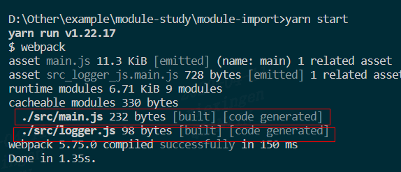
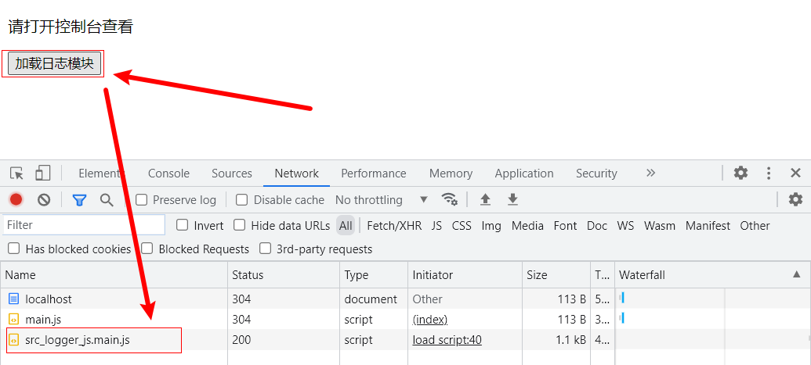
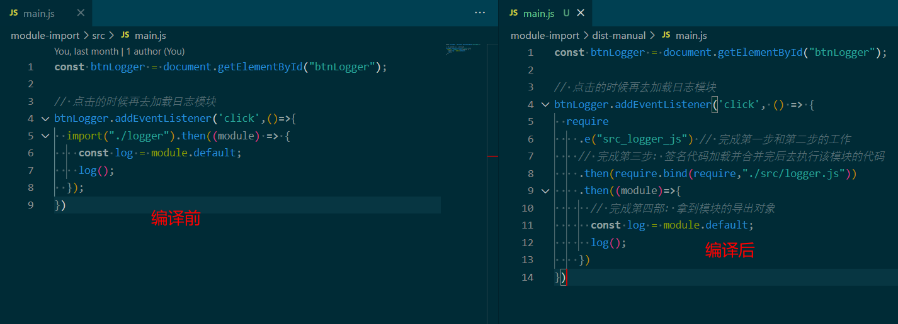

从分析构建产物出发,探索 Webpack 中异步加载(懒加载)的原理,最后将彻底弄清楚懒加载是如何做到能够加快应用初始加载速度的。

- 在 Webpack 搭建的项目中,如何达到懒加载的效果？
- 在 Webpack 中常用的代码分割方式有哪些？
- Webpack 中懒加载的原理是什么？

# 前置知识

懒加载或者按需加载,是一种很好的优化网页或应用的方式。这种方式实际上是先把你的代码在一些逻辑断点处分离开,然后在一些代码块中完成某些操作后,立即引用或即将引用另外一些新的代码块。这样加快了应用的初始加载速度,减轻了它的总体体积,因为某些代码块可能永远不会被加载

懒加载的本质实际上就是代码分离。把代码分离到不同的 bundle 中,然后按需加载或并行加载这些文件

在 Webpack 中常用的代码分离方法有三种:

- 入口起点

使用 [entry](https://webpack.docschina.org/configuration/entry-context) 配置手动地分离代码

- 防止重复

使用 [Entry Dependencies](https://webpack.docschina.org/configuration/entry-context/#dependencies) 或者 [SplitChunksPlugin](https://webpack.docschina.org/plugins/split-chunks-plugin) 去重和分离 chunk

- 动态导入(我们着重介绍的就是这货)

通过模块的内联函数调用来分离代码

当涉及到动态代码拆分时,Webpack 提供了两个类似的技术:

第一种,也是推荐选择的方式是,使用符合 [ECMAScript](https://github.com/tc39/proposal-dynamic-import) 提案 的 [import()](https://webpack.docschina.org/api/module-methods/#import-1)语法 来实现动态导入

第二种,则是 Webpack 的遗留功能,使用 Webpack 特定的 [require.ensure](https://webpack.docschina.org/api/module-methods/#requireensure) (不推荐使用) ,本文不做探讨
我们主要看看 [import()](https://webpack.docschina.org/api/module-methods/#import-1)语法 的方式

import() 的语法十分简单。该函数只接受一个参数,就是引用模块的地址,并且使用 promise 式的回调获取加载的模块。在代码中所有被 import() 的模块,都将打成一个单独的模块,放在 chunk 存储的目录下。在浏览器运行到这一行代码时,就会自动请求这个资源,实现异步加载

常见使用场景:路由懒加载

# 基础使用

我们先来看看使用 import() 异步加载的效果

在 main.js 中同步导入并使用:

```js
const btnLogger = document.getElementById('btnLogger');

// 点击的时候再去加载日志模块
btnLogger.addEventListener('click', () => {
  import('./logger').then((module) => {
    const log = module.default;
    log();
  });
});
```

logger.js

```js
// 假设这是一个日志模块
export default () => {
  console.log('日志模块执行了...');
};
```

先看打包结果:将 main.js 和 logger.js 打包成了两个文件(说明有做代码分割)



将打包后的文件在 index.html 中引入(注意这里只引用了 main.js ,并没有引用 src_logger_js.main.js)

在项目中执行 yarn start 将项目编译后,直接打开 dist 目录中的 index.html 可以看到




发现首次并没有加载 src_logger_js.main.js 文件(也就是 logger.js 模块),在点击按钮后才会加载。符合懒加载的预期,确实有帮助我们做异步加载

# 原理分析

结合现象看本质。在上面我们主要了解了异步加载的现象,接下来我们主要来分析和实现一下其中的原理

老规矩,先说整体思路:

第一步:当点击按钮时,先通过 jsonp 的方式去加载 logger.js 模块所对应的文件
第二步:加载回来后在浏览器中执行此 js 脚本,将请求过来的模块定义合并到 main.js 中的 modules 中去
第三步:合并完后,去加载这个模块
第四步:拿到该模块导出的内容
整体代码思路(这里函数命名跟源代码有出入,有优化过):



第一步:当点击按钮时,先通过 jsonp 的方式去加载 logger.js 模块所对应的文件

```js
const btnLogger = document.getElementById('btnLogger');
btnLogger.addEventListener('click', () => {
  require.ensure('src_logger_js'); //src_logger_js是logger.js打包后的chunkName
});
```

接下来就去实现 require.e 函数:

```js
// 接收 chunkId,这里其实就是 "src_logger_js"
require.ensure = function (chunkId) {
  let promises = []; //定义promises,这里面放的是一个个promise
  require.load(chunkId, promises); //给promises赋值
  return Promise.all(promises); //只有当promises中的所有promise都执行完成后,才能走到下一步
};
```

require.j 函数:这一步其实就是给 promises 数组赋值,并通过 jsonp 去加载文件

```js
//已经安装好的代码块,main.js 就是对应的main代码块,0 表示已经加载成功,已经就绪
const installedChunks = {
  main: 0,
};

// 这里传入的是 "src_logger_js" , []
require.load = function (chunkId, promises) {
  const promise = new Promise((resolve, reject) => {
    installedChunks[chunkId] = [resolve, reject]; // 此时installedChunks={ main: 0, "src_logger_js":[ resolve, reject ]}
  });
  promises.push(promise); // 此时promises=[ promise ]

  const url = require.publicPath + chunkId + '.main.js'; //拿到的结果就是 logger.js打包后输出的文件名称:src_logger_js.main.js,publicPath 就是我们在 output 中配置的 publicPath,默认是空字符串
  const script = document.createElement('script');
  script.src = url;
  document.head.appendChild(script); //将该脚本添加进来
};
```

第二步:加载回来后在浏览器中执行此 JS 脚本,将请求过来的模块定义合并到 main.js 中的 modules 中去

在第一步中我们通过 jsonp 的方式加载了 src_logger_js.main.js 文件,加载后需要立即执行该文件的内容,我们先来看看该文件长什么样子:

```js
self['webpackChunkmodule_import'].push([
  ['src_logger_js'],
  {
    './src/logger.js': (modules, exports, require) => {
      require.defineProperty(exports, {
        default: () => WEBPACK_DEFAULT_EXPORT,
      });
      const WEBPACK_DEFAULT_EXPORT = () => {
        console.log('日志模块执行了...');
      };
    },
  },
]);
```

这里的`self`其实就是`window`,`webpackChunkmodule_import`就是一个名字,它是`webpackChunk` + 我们 `package.json` 中的 `name` 字段拼接来的,我这里是 module-import

翻译过来就是要执行 window.webpackChunkmodule_import.push([xxx])这个函数,那接下来我们就实现一下它:接受一个二维数组作为参数,二维数组中,第一项是 moduleId,第二项是模块定义:

```js
//初始化:默认情况下这里放的是同步代码块,这里的demo因为没有同步代码,所以是一个空的模块对象
const modules = {};

//这里 chunkIds=["src_logger_js"] moreModules={xxx} logger.js文件的模块定义
function webpackJsonpCallback([chunkIds, moreModules]) {
  const resolves = [];
  for (let i = 0; i < chunkIds.length; i++) {
    const chunkId = chunkIds[i]; //src_logger_js
    resolves.push(installedChunks[chunkId][0]); //此时 installedChunks={ main: 0, "src_logger_js":[ resolve, reject ]} ,将 src_logger_js 的resolve放到resolves中去
    installedChunks[chunkId] = 0; //标识一下代码已经加载完成了
  }

  for (const moduleId in moreModules) {
    modules[moduleId] = moreModules[moduleId]; //合并modules,此时modules中有了 logger.js的代码
  }

  while (resolves.length) {
    resolves.shift()(); //执行promise中的resolve,当所有promises都resolve后,接下来执行第三步
  }
}

window.webpackChunkmodule_import.push = webpackJsonpCallback;
```

此时 modules 已经变为:

```js
var modules = {
  './src/logger.js': (modules, exports, require) => {
    require.defineProperty(exports, {
      default: () => WEBPACK_DEFAULT_EXPORT,
    });
    const WEBPACK_DEFAULT_EXPORT = () => {
      console.log('日志模块执行了...');
    };
  },
};
```

第三步:合并完后,去加载这个模块

走到这里 require.ensure 函数中的 Promise.all 已经走完,接下来走到第一个.then 处:require.bind(require, "./src/logger.js")

```js
require
  .ensure('src_logger_js') //完成第一步和第二步的工作
  .then(require.bind(require, './src/logger.js')); //完成第三步
```

require 的源码

```js
//已经加载过的模块
var cache = {};

//相当于在浏览器中用于加载模块的 polyfill
function require(moduleId) {
  var cachedModule = cache[moduleId];
  if (cachedModule !== undefined) {
    return cachedModule.exports;
  }
  var module = (cache[moduleId] = {
    exports: {},
  });
  modules[moduleId](module, module.exports, require);
  return module.exports;
}

require.defineProperty = (exports, definition) => {
  for (var key in definition) {
    Object.defineProperty(exports, key, {
      enumerable: true,
      get: definition[key],
    });
  }
};
```

这里执行完 require.bind(require, "./src/logger.js")后,返回的是一个 export 对象:

```js
{
  //因为这里是默认导出,所以是default
  default: () => {
    console.log('日志模块执行了...')
  }
}
```

第四步:拿到该模块导出的内容

```js
require
  .ensure('src_logger_js') //完成第一步和第二步的工作
  .then(require.bind(require, './src/logger.js')) //完成第三步:前面代码加载并合并完后,去执行该模块代码
  .then((module) => {
    //完成第四步
    const log = module.default;
    log();
  });
```

在第三步中导出的是一个 export 对象,又因为是默认导出,所以这里取值是 module.default,走到这里就完全走完啦。

# 完整代码

可以查看 [案例代码](https://github.com/xiexingen/module-study/tree/main/module-import)

# 总结

上面我们差不多用 50 行代码写了一个简易 demo 实现了懒加载原理,在该 demo 中当然还有一些场景没有考虑进去:比如当点击按钮时,只需第一次加载时去请求文件,后面加载时应该要去使用缓存。但这并不是重点,希望通过本章大家能够更加深入理解 Webpack 中的懒加载,早日摆脱 API 工程师
