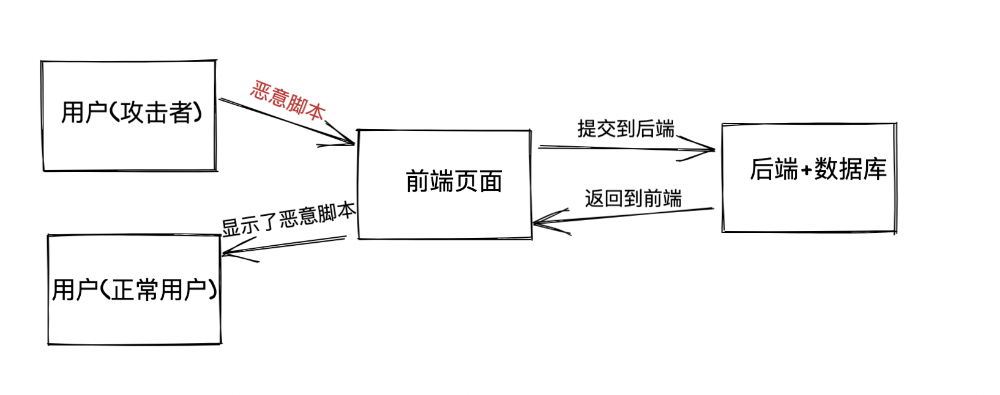
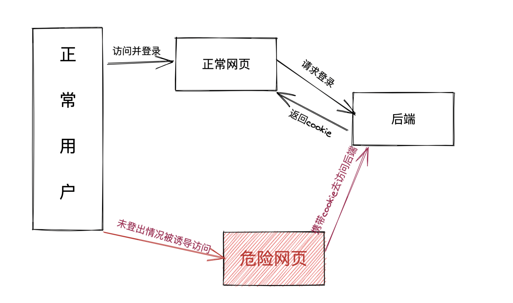
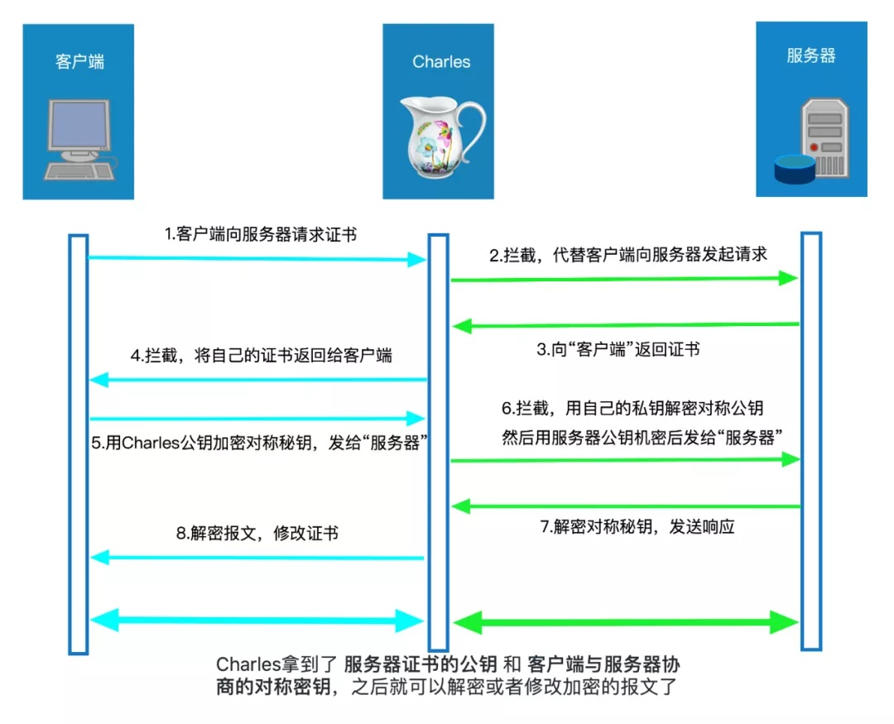
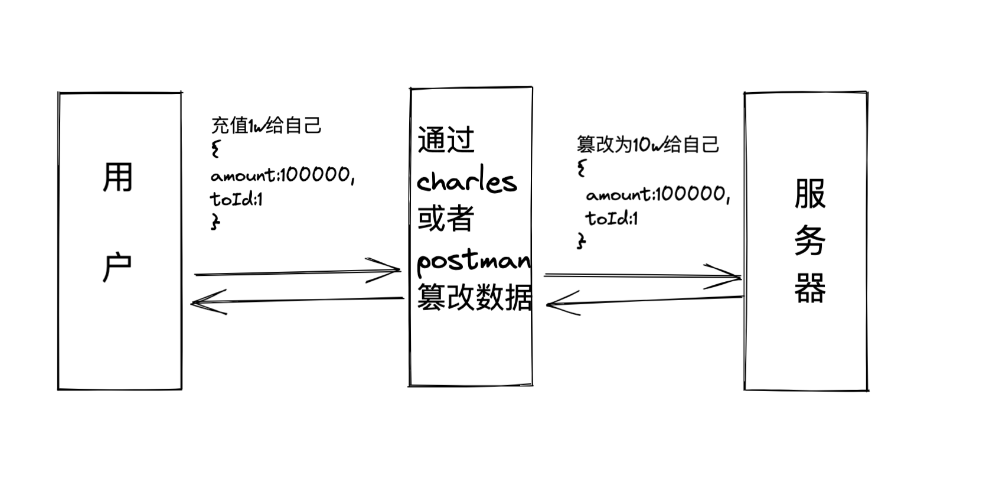

# 前端安全

## XSS

XSS 是跨站脚本攻击的简写，攻击者想尽一切方法 将一段脚本内容放到目标网站的目标浏览器上解释执行。攻击者将恶意脚本输入到目标网站中。当其他用户访问该网站的时候，由于浏览器不知道它是由网站提供服务的脚本还是攻击者埋入的脚本，因此将执行此该脚本。攻击者就可以很容易利用埋入的脚本进行攻击



### 攻击原理

1. 攻击者在前端页面输入框中录入了编写好的恶意脚本提交到服务器
2. 服务器存储用户的提交到数据库
3. 正常用户访问的时候服务器将数据库中的脚本返回给正常用户(浏览器并不知道是恶意脚本，执行了)

### 防范

1. 永远不要相信用户的输入，对用户输入的特殊字符进行转义、白名单等操作
2. cookie 设置 HttpOnly 配合 token 或者验证码防患

## CSRF

CSRF 是跨站请求伪造的简写，一种诱骗受害者提交恶意请求的攻击，攻击者盗用了你的身份，以你的名义发送恶意请求，请求到达后端时，服务器将无法区分恶意请求和合法请求。。CSRF 能够做的事情包括：以你名义发送邮件，发消息，盗取你的账号，甚至于购买商品，虚拟货币转账等



### 攻击原理

1. 登录受信任网站 A，在本地有 cookie
2. 在未登出的情况下访问了危险网站(这个网站访问到了 A 的 cookie)

### 防范

1. 同源检测，直接禁止外域（受信域可以开白名单）对我们发起请求
2. CSRF Token，就把 Token 以参数的形式加入请求了，提交给服务器的时候，服务器需要判断 Token 的有效性
3. Samesite Cookie 属性，Samesite=Strict 只允许同源网站提交请求携带 cookie

## 网络传输安全

中间人 (Man-in-the-middle attack, MITM) 是指攻击者与通讯的两端分别创建独立的联系, 并交换其所收到的数据, 使通讯的两端认为他们正在通过一个私密的连接与对方直接对话, 但事实上整个会话都被攻击者完全控制. 在中间人攻击中, 攻击者可以拦截通讯双方的通话并插入新的内容

是不是觉得有了 https 网络传输安全问题就迎刃而解了呢，即使被中间人拦截了，数据也是加密的。其实不是这样的，不知道大家有没有使用过 charles 进行抓包呢，如果数据都是加密的，为啥 charles 抓包后我们能够看到传输的明文呢，其实这就是中间人攻击



### 防范

1. 对于个人来说防止自己被中间人攻击最基本的就是不要乱连不安全的网络(如代理)
2. 公司 APP 来说应该配置禁止被抓包
3. APP 和浏览器都应该严格校验证书，不使用不安全的 APP 和浏览器

## 接口加签

我们知道 https 并不是绝对安全的，他是会被中间人劫持的，那么我们有什么方法防止数据被篡改呢? 接口加签的目的是防止数据被篡改！



案例

我们辛辛苦苦写了一个运营小游戏，违规用户随便玩了一下得分为 0，但是他通过 Charles 拦截了这个请求，修改了得分为 10000，然后进行提交，我们的正常服务器能否知道分数是被篡改的呢？

### 防范

给请求的参数加签

```bash
// 原本的请求参数为
{
  id:1,
  amount:10000
}
// 加签后的请求参数为
{
  id:1,
  amount:10000,
  uuid:'121231213', // 随机生成的一个唯一id
  time:'111111111', // 时间戳
  sing:'xxxxxxxxx', // 使用与后端约定好的加密算法，对上面的id、amount、uuid、time的值进行加密后的值，后端会同时使用对应方式加密 然后判断加密后的串是否跟sign相同，如果不同(表示被篡改过)丢弃
}
```

## 传输加密

有时候传输的数据不想明文被看见，比如:用户登录的用户名、密码、身份证号码、手机号码等

可以直接对传输的内容采用加密算法加密传递到后端

### 防范

#### 前端到后端

1. 后端以某种形式返回一个【公钥 A】给到客户端
2. 前端生成一个随机的【字符串 S】,使用【公钥 A】对【字符串 S】加密后得到【对称秘钥 SS】(非对称加密，比如:AES)
3. 前端使用【字符串 S】对请求内容进行加密(对称加密，如:3DESC)
4. 前端将【对称秘钥 SS】以及加密后的内容发送到后端

5. 后端解析出【对称秘钥 SS】，使用【公钥 A】对【对称秘钥 SS】进行解密 得到前端生成的【字符串 S】
6. 使用【字符串 S】再使用 3DESC 对内容进行对称解密得到原始内容

#### 后端响应到前端的加密

1. 后端生成一个随机【字符串 S】
2. 采用对称加密算法，以【字符串 S】为秘钥对响应给客户端的数据进行加密得到加密后的内容
3. 使用【私钥 A】对【字符串 S】加密得到【字符串 SS】
4. 将【字符串 ss】和加密后的内容返回给客户端
5. 客户端获取【字符串 ss】使用【公钥 A】解密后得到【字符串 s】(非对称)
6. 使用【字符串 s】采用对称加密对内容进行解密得到实际内容(对称)

> 可以参考我的实现

https://github.com/wetrial/wetrials/blob/master/packages/core/src/request/index.ts

## 接口防重放

防重放也叫防复用，简单来说,就是我获取到这个请求的信息之后, 我什么也不改, 我就拿着接口的参数去重复请求这个充值的接口，也就是说我的请求是合法的，因为所有参数都是跟合法请求一模一样的，也就是说: 服务端的 sign 验证一定能通过。如图上的例子，即使我们不知道登录账户名密码，即使接口参数被加签加密了，我们依旧能够登录并拿到登录信息，我们根本不用关心加密加签的逻辑，我们只需要简单的重放攻击即可

### 防范

1. 客户端请求的时候附带一个随机的 uuid
2. 服务器端去缓存中查找这个 uuid，如果没有则允许通过并把这个 uuid 加入到缓存(比如 redis+时效),否则算重复处理

## 环境检测

是不是浏览器、是不是 selenium 等

## 验证码

## 代码混淆加密
