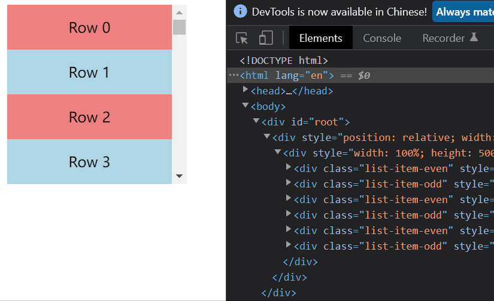
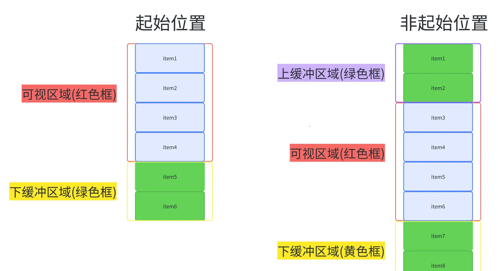
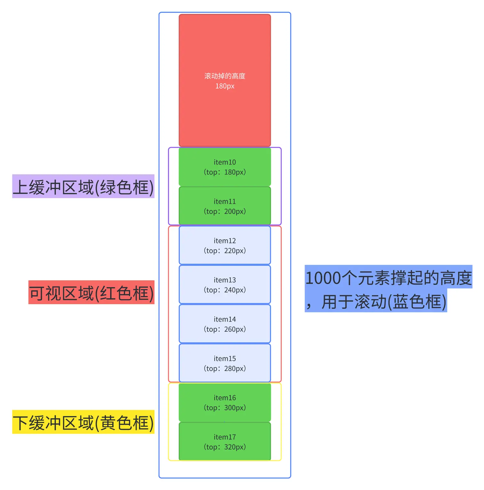
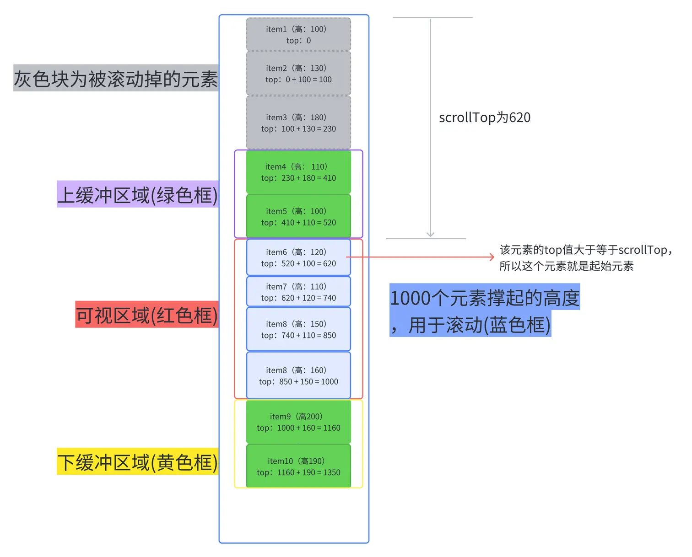

百万数据的展示怎么优化

<!-- 先看个不使用虚拟列表渲染大量数据的情况 -->

<!-- <code src="./demos/virtual-list/normal.tsx"></code> -->

# 虚拟列表的核心原理

先看看使用虚拟列表后的表现

看右边的元素个数，会发现起初只有 6 个，之后无论怎么滚动，他都保持着 8 个元素，由此我们可以得出他的静态原理图是这样的

当我们往下滚动后

从上面两图我们可以总结出，整个虚拟列表划分为三个区域，分别是上缓冲区(0/2 个元素)，可视区(n 个元素)，下缓冲区(2 个元素)。当我们滚动到一个元素离开可视区范围内时，就去掉上缓冲区顶上的一个元素，然后再下缓冲区增加一个元素。这就是虚拟列表的核心原理了

## 元素高度固定的虚拟列表

### 实现思路

1. 首先先计算出由 1000 个元素撑起的盒子(称之为 Container)的高度，撑开盒子，让用户能进行滚动操作
2. 计算出可视区的起始索引、上缓冲区的起始索引以及下缓冲区的结束索引（就像上图滚动后，上缓冲区的起始索引为 2，可视区起始索引为 4，下缓冲区结束索引为 9）
3. 采用绝对定位，计算上缓冲区到下缓冲区之间的每一个元素在 Contianer 中 的 top 值，只有知道 top 值才能让元素出现在可视区内
4. 将上缓冲区到下缓冲区的元素塞到 Container 中

如图所示

### 案例

<code src="./demos/virtual-list/fixed-height-item/index.tsx"></code>

## 元素不定高的虚拟列表

由于每一行的高度是随机的，就不能像第一种虚拟列表那样简单得通过 itemHeight \* index 计算出 top 值了

问题

1. 由于每个元素高度不一，我们无法直接计算出 Container 的总高度

可以通过遍历所有的行计算出总高度，但个人认为计算出精确总高度的必要性不大，同时也为了兼容第三种虚拟列表，我们不去计算精确的总高度。现在我们回到出发点，思考 Container 的高度的作用是什么？其实就是为了足够大，让用户能进行滚动操作，那我们可以自己假设每一个元素的高度，在乘上个数，弄出一个假的但足够高的 Container 让用户去触发滚动事件。当然这种方案会带来一些小问题（问题不大，我们先无视掉）

2. 每个元素高度不一，每个元素的 top 值不能通过 itemHeight \* index 直接计算出 top 值

3. 每个元素高度不一，不能直接通过 scrollOffset / itemHeight 计算出已被滚动掉的元素的个数，很难获取到可视区的起始索引

其实难点 2 和难点 3 本质都一样，元素高度不一，导致不知道被滚动掉了多少元素，只要知道被滚动掉的元素的个数，top 值和索引都迎刃而解。

我们可以采用这种解决方案，那就是每次只需要计算上缓冲区到下缓冲区之间的元素，并记录他们，并且记录下最底下的那个元素的索引，当用户进行滚动时，如果我们是向上滚动，就可以直接从已经计算好的记录里取，如果向下滚动，我们根据上一次记录的最大的索引的那个元素不断累加新元素的高度，直到它大于已经滚动掉的高度，此时的索引值就是可视区的起始索引了，这个起始索引所对应的 top 就是累加的高度

如图所示

每一个元素的 top 值都能通过上一个元素的 top 值 + 上一个元素的 height 计算出来。

举个例子，假设我们需要知道 item14 的 top 值

a. 我们先在记录里找有没有 item13 的数据，如果有，我们就拿 item13.top + item13.height 得到 item14 的 top

b. 如果记录中（由上图得知我们只记录了 item1 - item10 的数据）没有，我们就拿到记录中最后一个元素的数据（item10）进行累加，先计算并记录 item11 的，再计算并记录 item12 的，再计算并记录 item13 的，最后就是 item14 的了

### 案例

<code src="./demos/virtual-list/variable-height-item/index.tsx"></code>

## 元素不定高的虚拟列表

最后这一种虚拟列表其实就是基于第二种来实现的，只不过增加监听元素高度变化事件，在某个元素发生变化的时候重新计算各种数据

### 案例

<code src="./demos/virtual-list/dynamic-height-item/index.tsx"></code>
